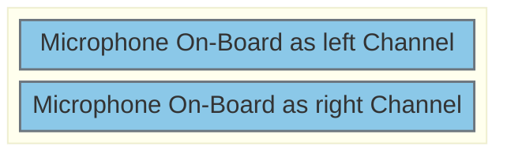
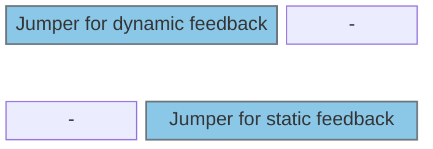

# Configure Audio Codec / Periphery

## Jumpers and DIP Switches

Jumper J601 (use to connect On Board Mic to Codec)

---

Jumper J604

- Top Position = dynamic feedback
- Bottom Position = static feedback
- none = use no feedback

## Pinout:
- peripheries needed:
	- 1x I2S full duplex
	- 1x I2C

- H755
	- 
	- 
	- 

- F469:
	- 
	- 
	- 