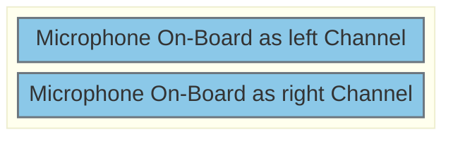
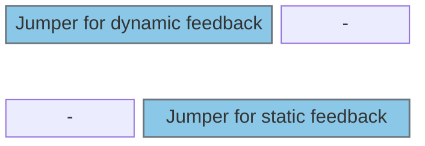
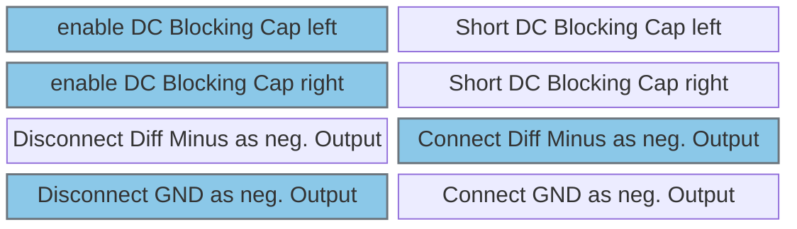
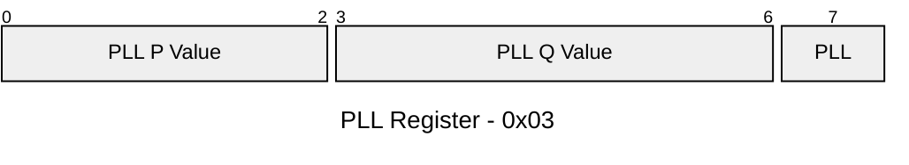
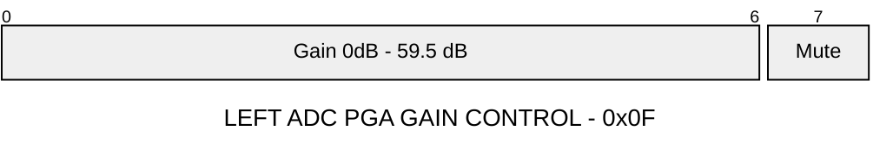
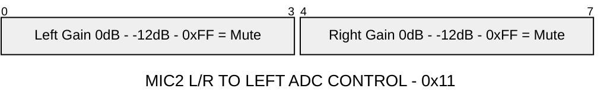

# Configure Audio Codec / Periphery

## Jumpers and DIP Switches

Jumper J601 (use to connect On Board Mic to Codec)

---

Jumper J604

- Top Position = dynamic feedback
- Bottom Position = static feedback
- none = use no feedback

DIP Switch SW601 (blue for recommended settings)

## Registers modified in example SW

## Pinout:
- peripheries needed:
	- 1x I2S full duplex
	- 1x I2C

- H755
	- I2S_SDA  | PB15
    - I2S_SDAe | PB4
    - I2S_MCLK | PC6
    - I2S_WCLK | PB12
	- I2S_BCLK | PB13
    (Jumper SB8 on H755 needs to be placed)  
    ---
    - I2C_SDA | PB8
    - I2C_SCL | PB9
    ---
    - nReset  | PG14

- F469:
	- I2S_SDA  | PC1
    - I2S_SDAe | PC2
    - I2S_MCLK | PC6
    - I2S_WCLK | PB12
	- I2S_BCLK | PB13
    ---
    - I2C_SDA PB8
    - I2C_SCL PB9
    ---
    - nReset  | PG13