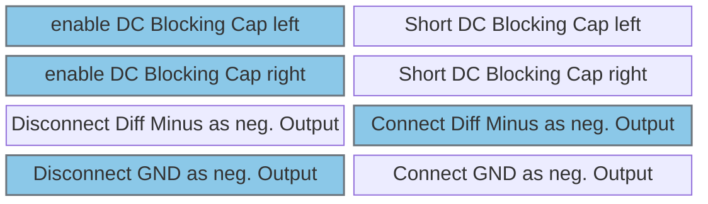

# Configure Audio Codec / Periphery

## Jumper J104 (use to connect On Board Mic to Codec)

Position:  

Jumper for F469:  

Jumper for H755:  

---

## Jumper J604

Position:  

Jumper for dynamic feedback:  

Jumper for static feedback:  

Jumper for no feedback:  

## Jumper J601

Position:  

enable Microphone for left channel:  

enable Microphone for right channel:  

DIP Switch SW601 (blue for recommended settings)

---

# Pinout F469:

### I2S
| Function | Pin | Info |
|----------|-----|------|
| I2S_SDA  | PC1 | |
| I2S_SDAe | PC2 | |
| I2S_MCLK | PC6 | |
| I2S_WCLK | PB12 | |
| I2S_BCLK | PB13 | |

### I2C
| Function | Pin | Info |
|----------|-----|------|
| I2C_SDA  | PB8 | shared |
| I2C_SCL  | PB9 | shared |

### GPIOs
| Function | Pin | Info |
|----------|-----|------|
| nReset   | PG13 | Output |

---

# Pinout H755:

### I2S
| Function | Pin | Info |
|----------|-----|------|
| I2S_SDA  | PB15 | |
| I2S_SDAe | PB4 | |
| I2S_MCLK | PC6 | |
| I2S_WCLK | PC6 | |
| I2S_BCLK | PB13 | Jumper SB8 on H755 needs to be placed |

### I2C
| Function | Pin | Info |
|----------|-----|------|
| I2C_SDA  | PB8 | shared |
| I2C_SCL  | PB9 | shared |

### GPIOs
| Function | Pin | Info |
|----------|-----|------|
| nReset   | PG14 | Output |

---

