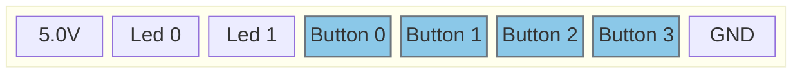

# Configure Buttons

## Pinout
J801 [Ext. Periphery]

## Connection Type
In oder to connect an external button or switch use one of the button pins on connector J801.
Connect the Button so, that it connects the pin to GND.
> [!Caution]
> the button input is low active.

---

# Pinout F469:

### GPIOs
| Function | Pin | Info |
|----------|-----|------|
| Button 0   | PA7 | Input |
| Button 1   | PA2 | Input |
| Button 2   | PG12 | Input |
| Button 3   | PA1 | Input |

---

# Pinout H755

### GPIOs
| Function | Pin | Info |
|----------|-----|------|
| Button 0   | PD15 | Input |
| Button 1   | PE11 | Input |
| Button 2   | PE14 | Input |
| Button 3   | PE13 | Input |

---
 

