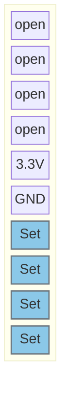
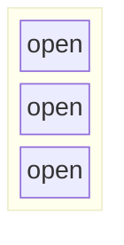

Position:

## J102

Jumper:  

## J106

Jumper:  

## J106

## J106

 
 ---

# Pinout:

### SPI ?
| Function | Pin | Info |
|----------|-----|------|
| SPI_MOSI  | PA5 | |
| SPI_MISO | PA8 | |
| SPI_SCK | PB4 | |
| SPI_NSS | PA15 | |

### GPIOs
| Function | Pin | Info |
|----------|-----|------|
| NFC_int   | PB1 | Input |

---

