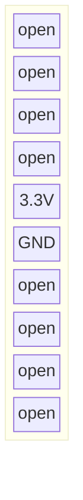
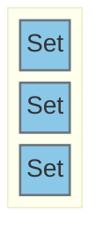

Position:

## J102

Jumper:  

## J106

Jumper:  

## J106

## J106

# Pinout:

### I2C
| Function | Pin | Info |
|----------|-----|------|
| I2C_SDA  | PB8 | shared |
| I2C_SDA  | PB9 | shared |

### GPIOs
| Function | Pin | Info |
|----------|-----|------|
| NFC_int   | PA3 | Input |

---