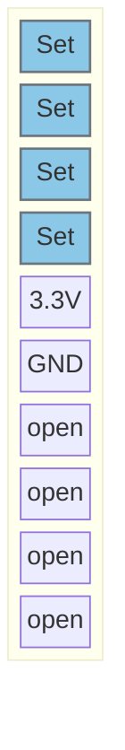
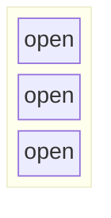

Position:

## J102

Jumper:  

## J106

Jumper:  

## J106

## J106

---

# Pinout:

### SPI ?
| Function | Pin | Info |
|----------|-----|------|
| SPI_MOSI  | PB5 | |
| SPI_MISO | PG9 | |
| SPI_SCK | PB3 | |
| SPI_NSS | PA4 | |

### GPIOs
| Function | Pin | Info |
|----------|-----|------|
| NFC_int   | PA3 | Input |

---