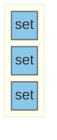

# Configure NFC to communicate by I2C

## Jumpers

Jumper J102 [I2C NFC]

- H755
    - I2C_SDA | PB8
    - I2C_SCL | PB9
    ---
    - NFC_int | PA3

- F469:
    - I2C_SDA | PB8
    - I2C_SCL | PB9
    ---
    - NFC_int | PB1