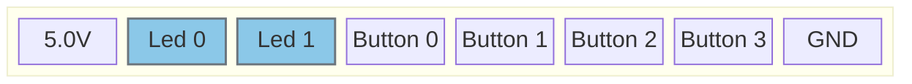

# Configure Leds

## Pinout
J801 [Ext. Periphery]

## Connection Type
In oder to connect an external led use one of the led pins on connector J801 to connect the leds cathode.
Connect the annode of the led to the pos Voltage of Choice (+5V is available on the Connector).
> [!Caution]
> the led output is low active.
> do not connect a positive Voltage greater than 30V.