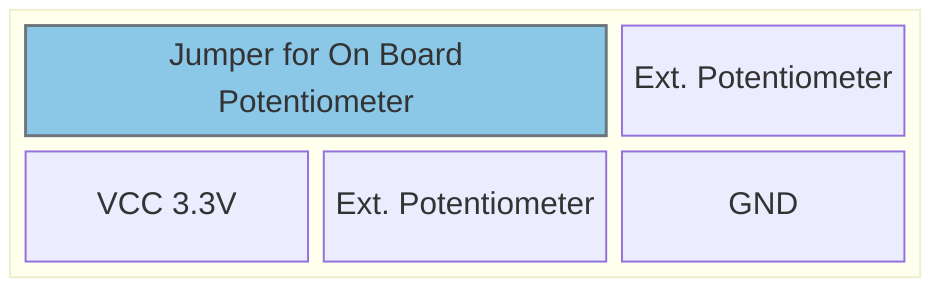
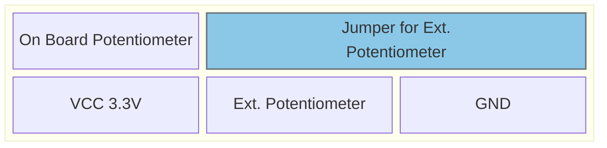

# Configure internal / external Potentiometers

## Jumpers and connections J802/J803

Position:  

Jumper use Potentiometer on Board:  

Jumper use Potentiometer external:  

Select on-board Potentiometer

Select ext. Potentiometer

---

# Pinout F469:

### Analog
| Function | Pin | Info |
|----------|-----|------|
| Potentiometer 0   | PC4 | Input |
| Potentiometer 1   | PC3 | Input |

---

# Pinout H755

### Analog
| Function | Pin | Info |
|----------|-----|------|
| Potentiometer 0   | PB1 | Input |
| Potentiometer 1   | PC3 | Input |

---
