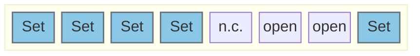

# Configure WLAN/BLE to communicate by SPI

## J103

Position:  

Jumper:  

Jumper J103 set WLAN/BLE using SPI

---

# Pinout F469:

### SPI
| Function | Pin | Info |
|----------|-----|------|
| SPI_MOSI  | PB15 | |
| SPI_MISO | PB14 | |
| SPI_SCK | PD3 | |
| SPI_NSS | PH6 | |

---

# Pinout H755:

### SPI
| Function | Pin | Info |
|----------|-----|------|
| SPI_MOSI  | PB5 | validate!!! |
| SPI_MISO | PA6 | |
| SPI_SCK | PA5 | |
| SPI_NSS | PD14 | |

---
