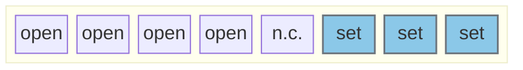

# Configure WLAN/BLE to communicate by UART

### Jumpers

Jumper J103 set WLAN/BLE using UART

### Pinout:
- peripheries needed:
	- 1x UART

- H755
    - UART_TX | PB6
	- UART_RX | PB7

- F469:
    - UART_TX | PG14
	- UART_RX | PG9