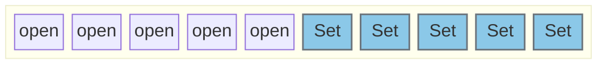
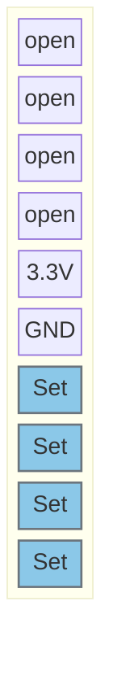
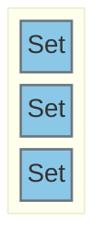

# F469 Jumper Positions

J104 [Audio]

```mermaid
block-beta
    block
        columns 10
        a0["open"]
        a1["open"]
        a2["open"]
        a3["open"]
        a4["open"]
        a5["Set"]
        a6["Set"]
        a7["Set"]
        a8["Set"]
        a9["Set"]
    end

classDef highlighter fill:#8bc8e8,stroke:#6c757d,color:#000000,stroke-width:1.5px;
class a5 highlighter
class a6 highlighter
class a7 highlighter
class a8 highlighter
class a9 highlighter
```

J106 [NFC] -> if you want to connect NFC using I2C leave all connection open

```mermaid
block-beta
    block
        columns 1
        a0["open"]
        a1["open"]
        a2["open"]
        a3["open"]
        a4["3.3V"]
        a5["GND"]
        a6["Set"]
        a7["Set"]
        a8["Set"]
        a9["Set"]
    end

classDef highlighter fill:#8bc8e8,stroke:#6c757d,color:#000000,stroke-width:1.5px;
class a6 highlighter
class a7 highlighter
class a8 highlighter
class a9 highlighter
```

J106 [NFC] -> if you want to connect NFC using SPI leave all connection open

```mermaid
block-beta
    block
        columns 1
        a0["Set"]
        a1["Set"]
        a2["Set"]
    end

classDef highlighter fill:#8bc8e8,stroke:#6c757d,color:#000000,stroke-width:1.5px;
class a0 highlighter
class a1 highlighter
class a2 highlighter
```