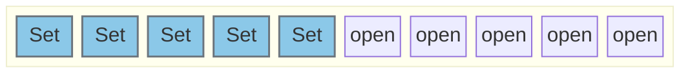

# H755 Jumper Positions

## J104

```mermaid
block-beta
    block
        columns 10
        a0["Set"]
        a1["Set"]
        a2["Set"]
        a3["Set"]
        a4["Set"]
        a5["open"]
        a6["open"]
        a7["open"]
        a8["open"]
        a9["open"]
    end

classDef highlighter fill:#8bc8e8,stroke:#6c757d,color:#000000,stroke-width:1.5px;
class a0 highlighter
class a1 highlighter
class a2 highlighter
class a3 highlighter
class a4 highlighter
```

## NFC
NFC can be configured to use either SPI or I2C choose one configuration:
- [SPI](../Config/NFC_SPI_H755.md)
- [I2C](../Config/NFC_I2C_H755.md)