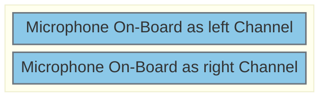
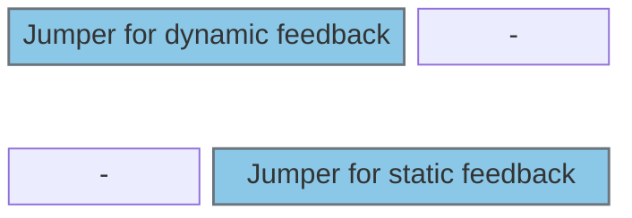
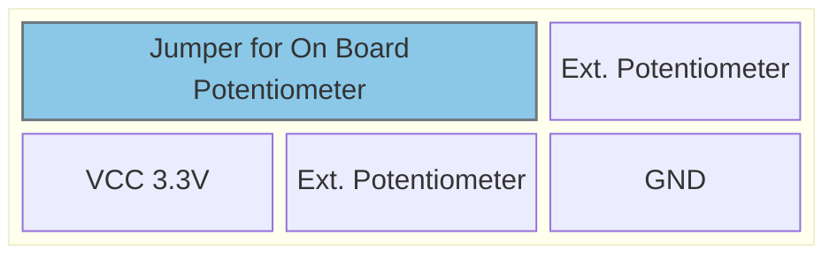
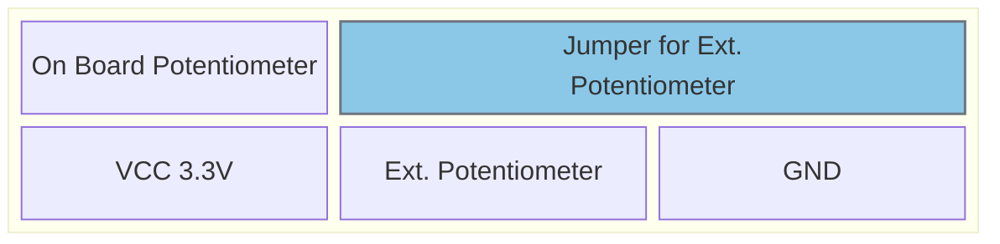

# Hardware
This folder contains all HW-Files and descriptions
---
## Info
The name for the Microcontroller/Evaluation Boards will be abreviated in the instaructions as the following:
- Voicemail-Box Board: 	VMBB
- STM32F469-Disco:		F469
- Nucleo-H755:			H755
- X-Nucleo NFC8:		NFC8
- P-Mod ESP32:			PMOD
...

---
## HW Setup
The VMBB is made to be soldered in a full and a partial configuration as well as beeing compatible with
multiple Microcontrollerboards (F469 and H755)

The partial configuration is made for people that are inexperienced with soldering / are lacking equipment.  
The full configuration is made as the de-facto correct way of manufacturing at the cost off beeing way more difficult to produce.

to use one or the other, select the correct BOM to solder and only solder the mentioned parts. There are no differences in the use of the finished board.

- tbd: make the BOMs and a assembly plan 

---
## PSU Setup
There is two ways to Supply the Eval Board:
- Supply using the Connector for ST-Link on the Eval-Boards
	- Set the Supply Jumper on H755 or F469 to STLINK
	- only connect the micro-usb to the H755 / F469
	- use only when you are certain, that your power draw is low (meaning mostly "no External Speakers")

- Supply using the USB Type-C Connector on the VMBB
	- Set the Supply Jumper on H755 or F469 to E5V
	- connect USB-C to supply on VMBB and MIcro-USB on H755 or F469 to connect programmer/debugger
	- use for permanent setup (when you are finished with the coding)
	- use when you have a more power demanding setup

- tbd: add pictures

# HW Parts
This section describes all HW Parts and how to connect, in case you start from a completly new project
or you have lost the configuration for no further specified reasons.

---
## Audio Interface

### Jumpers and DIP Switches

Jumper J601 (use to connect On Board Mic to Codec)

Jumper J604
- Top 		Position
- Bottom 	Position

- none = use no feedback

### Pinout:
- peripheries needed:
	- 1x I2S full duplex
	- 1x I2C

- H755
	- 
	- 
	- 

- F469:
	- 
	- 
	- 

---
## WLAN / BLE

---
## NFC

---
## Micro SD

---
## Potentiometer

### Jumpers and connections
Header J802/J803

### Pinout:
- peripheries needed:
	- 2x Analog In

- H755
	- PB1 = Pot 0
	- PC3 = Pot 1

- F469:
	- PC4 = Pot 0
	- PC3 = Pot 1