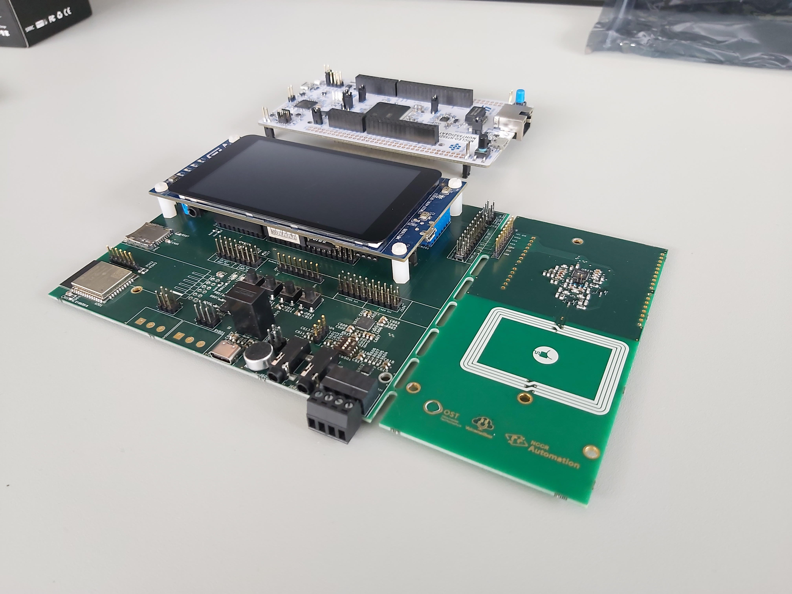

# Voicemail-Box

## About
Modern-day communication is more and more reliant on smartphones. This can cause issues in numerous situations. It can alienate people with writing, seeing, or technological deficiencies. 

Since the development of new electronic systems is often too complicated for non-affine people, the goal is to develop a platform that makes it easier to get started with such a project. The highest priority was given to audio input and output, user differentiation/management, file saving, and transferring those wirelessly.

<tr>
<td>

     

</td>

---
## Repository overview
The repository is structured the following way:
- **Hardware** folder contains the hardware specific project.  
[Go to Hardware Dokumentation](Hardware/README.md)

- **Software** folder contains the main source code and api.  
[Go to Software Dokumentation](Software/BSP_VoiceMailBox/README.md)

---
## Features
The Voicemailbox Development Platform offers the basic hardware and software components to develop specific use cases out of it.
The custom PCB is designed to be flexible for different kind of configurations and the software is built in a modular and structural way, using modern C++ to be able to abstract hardware components better and make it easy to develop custom business logic on to it.

### The current state of development features the following:
- Recording audio from different sources:
  - Audio jack for left and right audio channel.
  - Built-in microphone
- Playback audio to the audio output jack
- Filesystem using a SD-Card and easy to use file class for reading and writing files
- Two different audio encodings for files are supported:
  - **WAV** Which is a lossless easy to write/read file format for audio data with the downside of beeing very large in filesize.
  - **MP3** Which is a more common used audio format, much more compressed and the prefered choice for a application such as this one.
            The only downside is, that it is not fully supported on a **M7** core.
- Testserver implementation that manages file upload/download.
  With the help of the ESP32, files can be uploaded/downloaded from a server using a WIFI connection.
  No user authentication is implemented at the current state of the development.
- Two free programmable LED's.
- Four free programmable buttons.
- Two free programmable analog inputs.
  
### Untested features:
- Playback using the speaker connection (J603) is implemented in hardware but not implemented and tested in the software.
