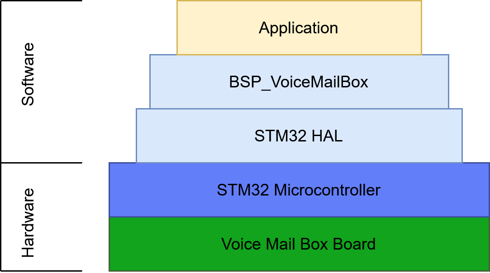
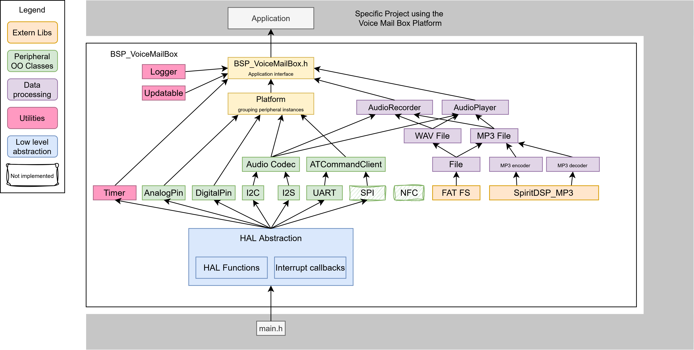

# BSP Voice Mail Box

## About
The Voice-Mail-Box Project (VMB in short) provides a Board Support Package (BSP) that abstracts all key peripheral components using c++.

---
## Content
- [Overview](#overview)
  - [Detailed Software structure overview](#detailed-software-structure-overview)
  - [Peripheral classes](#peripheral-classes)
  - [Data processing classes](#data-processing-classes)
- [Demos](#demos)
  - [Using STM32F469I-DISCOVERY](#using-stm32f469i-discovery)

---
## Overview
A very brief visualisation about the software hirarchy is displayed below.
<tr>
<td>

     

</td>

---
### Detailed Software structure overview 
This view displays the relation between the key software components delivered by the BSP.
The Application must include only the **BSP_VoiceMailBox.h** header file, it already includes all relevant hardware components and software tools related to the VMB.

<tr>
<td>

     

</td>

### Peripheral classes
- [AnalogPin](documentation/AnalogPin.md)
- [DigitalPin](documentation/DigitalPin.md)
- [I2C](documentation/I2C.md)
- [I2S](documentation/I2S.md)
- [UART](documentation/UART.md)
- [AudioCodec](documentation/AudioCodec.md)
  - [TLV320AIC3104](documentation/TLV320AIC3104.md)
- [ATCommandClient](documentation/ATCommandClient.md)

### Data processing classes
- [File](documentation/File.md)
  - [WAV File](documentation/WAVFile.md)
  - [MP3 File](documentation/MP3File.md)
- MP3
  - [MP3 Encoder](documentation/MP3_encoder.md)
  - [MP3 Decoder](documentation/MP3_decoder.md)
- [Audio Recorder](documentation/AudioRecorder.md)
- [Audio Player](documentation/AudioPlayer.md)

---
## Demos
### Using STM32F469I-DISCOVERY
- [HelloAudio](../Demos/F469/F469_HelloAudio/README.md) empty application + setup guide.
- [Multi Example](../Demos/F469/F469_MultiExample/README.md) project, containing multiple small examples for different classes of this project.

---
## Unfinished
- [TLV320AIC3104 Audio Codec](documentation/TLV320AIC3104.md) has only the most basic functions implemented and can be expanded to use its full potential.
---
## Needs to be implemented
- SPI class to communicate with the ESP32
- SPI compatibility with the [ATCommandClient](documentation/ATCommandClient.md) class in order to use SPI for sending and receiving AT-Commands. 
- NFC class to read NFC tags.