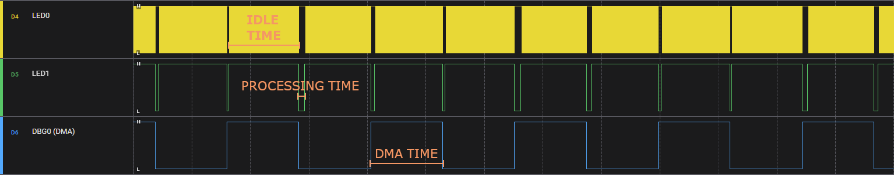
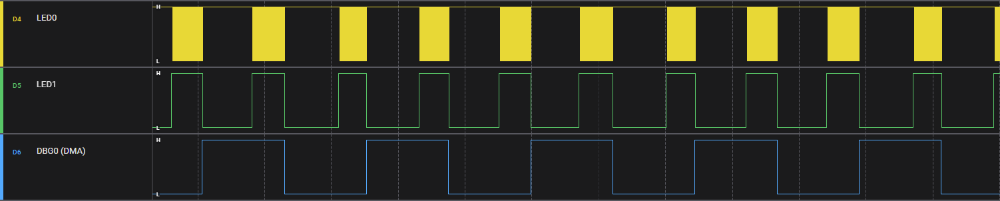
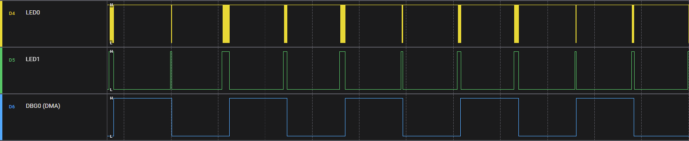
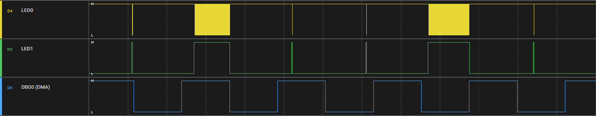

# Codec_TLV320AIC3104 Audio codec
>The TLV320AIC3104 is a low-power stereo audio codec with stereo headphone amplifier, 
as well as multiple inputs and outputs that are programmable in single-ended or fully differential configurations. 
The device includes extensive register-based power control is included, thus enabling stereo 48-kHz DAC
playback as low as 14 mW from a 3.3-V analog supply, 
making the device ideal for portable battery-powered audio and telephony applications.

Source from the datasheet: [TLV320AIC3104](https://www.ti.com/product/de-de/TLV320AIC3104)
You can find a ready to run project [here](../../Demos/F469/F469_MultiExample/README.md).

---
## Content
- [Features](#features)
- [Setup](#setup)
- [Usage](#usage)
  - [Modify main.h and main.c](#modify-mainh-and-mainc)
  - [Inside the C++ Application](#inside-the-c-application)
- [Performance tracking](#performance-tracking)
  - [Results](#results)
    - [Good processing utilizatuion](#good-processing-utilizatuion)
    - [Okey processing utilization](#okey-processing-utilization)
    - [Bad processing utilization](#bad-processing-utilization)
    - [Worst processing utilization](#worst-processing-utilization)
  - [Finding a good utilization](#finding-a-good-utilization)
- [Currently available signal path](#currently-available-signal-path)

---
## Features
This codec is very complex and features much more than needed for the Voice Mail Box.
The most features are therefore not implemented into the class for easy usage.
The following features are implemented so far:
- Starting and stopping of the I2S DMA
- Easy access to the microphone and speaker data arrays.
- Performance benchmarking for checking audio processing time vs DMA time
- Setting the microphone gain in dB
  
---
## Setup
The audio codec uses a I2C for configuration, a I2S for audio sample transfer and an digital reset pin.
Visit the following pages to setup a I2C, I2S one digital output pin.<br>
[I2C setup](I2C.md/#setup)<br>
[I2S setup](I2S.md/#setup)<br>
[Digital Pin setup](DigitalPin.md/#setup)<br>
Make sure the C++ application is setup in order to use this class
You can find the instructions on how to do so [here](CppFromC.md).


---
## Usage
CubeMX generates a **I2S_HandleTypeDef** and **I2C_HandleTypeDef** instance in the **main.c**
The **Codec_TLV320AIC3104** class needs access to these handles. Since the C++ code can't be used directly in the **main.c**, another way of getting to the handle is needed.

#### Modify main.h and main.c
In the **main.h** create a get function that returns a pointer to the handles.
``` C
// main.h

// Function declaration
I2S_HandleTypeDef* getI2S_handle();
I2C_HandleTypeDef* getI2C_handle();
```

``` C
// main.c

/* Private variables generated by CubeMX */
I2S_HandleTypeDef hi2s1;
I2C_HandleTypeDef hi2c1;

/* USER CODE BEGIN PV */
// Function implementation
I2S_HandleTypeDef* getI2S_handle()
{
    // Return the pointer to the handle
    return &hi2s1;
}
I2C_HandleTypeDef* getI2C_handle()
{
    // Return the pointer to the handle
    return &hi2c1;
}
/* USER CODE END PV */
```

#### Inside the C++ Application


``` C++ 
// Application.cpp
#include "BSP_VoiceMailBox.hpp" // includes the needed peripheral headers
#include "main.h" // Is needed to access the handle get function

// using a namespace globaly is not recommended for production
// but it simplyfies the example here
using namespace VoiceMailBox; 

Codec_TLV320AIC3104* codec = nullptr;
I2C *i2c = nullptr;

void setup()
{ 
    // Create a I2C object on which the codec is connected
    i2c = new VoiceMailBox::I2C(getI2C_Handle());

    // Create a codec object and providing the I2S and I2C haldes.
    // 1024 for the I2S buffer size which is only used when the macro "VMB_I2S_USE_STATIC_BUFFER_SIZE" is not defined in the settings.h.
    // 0x18 is the default I2C address of the TLV320AIC3104 and can be found in its datasheet.
    // GPIO_TypeDef* and pin must be passed. It is the Reset pin of the codec: PIN 31.
    codec = new Codec_TLV320AIC3104(getI2S_handle(), 1024,
                                    *i2c, 0x18,
                                    CODEC_NRESET_GPIO_Port, CODEC_NRESET_Pin);

    codec->setup();
}

// Called periodically
void loop()
{
    // Process the codecs audio data
    if (codec->isDataReadyAndClearFlag())
    {
        int16_t* txBuffer = (int16_t*)codec->getTxBufPtr();
        int16_t* rxBuffer = (int16_t*)codec->getRxBufPtr();
        uint32_t size = codec->getBufferSize();

        // Redirect capture to the output
        memcpy(txBuffer, rxBuffer, size * sizeof(int16_t));
    }
}
```

---
## Performance tracking
Processing audio happens while the audio codec already sends new audio samples. Therefore chunks of audio samples are processed and after processing the main loop waits until a new chunk of audio samples are available or requested, depending if audio gets captured or played back.
Processing the audio must not take longer than the I2S DMA needs to send/receive the new chunk of samples. If the processing takes longer than the DMA, that means that at some point, some samples are lost because the DMA overwrites samples that are not processed yet.
Measuring the time it takes to perform the signal processing vs DMA time is key to know if the application works as expected.
The AudioCodec class offers a interface that can mesure the performance ratio. That value is the processingTime devided by the DMATime and must be lower than 1. If it is larger than one, it means that the signal processing takes longer as allowed.

Make sure that the macro `VMB_ENABLE_CODEC_PERFORMANCE_MEASUREMENTS` is defined in the settings.h, otherwise no performance measurement will take place.
To use the performance mesurement, the function `codec.startDataProcessing();` must be called and at the end of processing the `codec.endDataProcessing();`.
The performance is returned by the function: `codec.getProcessingTimeRatio();`.
``` C++
#include "BSP_VoiceMailBox.hpp"
#include <memory>
void setup()
{
    VoiceMailBox::setup();
}
void loop()
{
    using namespace VoiceMailBox;
    DigitalPin& led0 = getLed(LED::LED0);
    DigitalPin& led1 = getLed(LED::LED1);

    led0.set(1);

    VoiceMailBox::update();
    AudioCodec& codec = getCodec();
    AnalogPin& potentiometer = getPotentiometer(Potentiometer::POT1);

    led0.set(0);
    if (codec.isDataReadyAndClearFlag())
    {
        // Start processing
        led1.set(1);
        codec.startDataProcessing();                              // Used to mesure processing performance
        uint32_t potentiometerValue = potentiometer.getValue();
        uint32_t delayMS = maxDelayMS - ((double)potentiometerValue * maxDelayMS / (double)potentiometer.getMaxValue()); // 0 - 100 ms

        int16_t* rxBuffer = (int16_t*)codec.getRxBufPtr();
        int16_t* txBuffer = (int16_t*)codec.getTxBufPtr();
        uint32_t bufferSize = codec.getBufferSize();

        delay(delayMS);											  // simulate processing time
        memcpy(txBuffer, rxBuffer, bufferSize * sizeof(int16_t)); // Redirect capture to the output
        codec.endDataProcessing();                                // Used to mesure processing performance
        led1.set(0);
        // End processing

        // The optimal ratio is between 0 and 1, smaller is better.
        float performanceRatio = codec.getProcessingTimeRatio();
        if (performanceRatio > 1)
        {
            println("Processing time utilization: %.2f%% ! Processing takes longer than it should !", performanceRatio * 100.0f);
        }
        else
        {
            println("Processing time utilization: %.2f%%", performanceRatio * 100.0f);
        }
    }
}
```

### Results
Below are different examples that are generated using the code above. 
The yellow graph shows the signal for the LED0 which is turned on at the start of the `loop()` function and turned off before the the codecs data ready flag gets read.
The green graph shows the signal for the LED1 which is turned on at the start when the codec has confirmed to have new audio samples available.
The green signal is turned off after the processing has finished.

> [!NOTE] 
> Both leds, LED0 and LED1 are inverted on the PCB, therefore when the signal is low, that means that the LED is actually turned on.
 
The blue graph shows the internaly used DBG0 pin which is not wired to any pin on the PCB. It is on the **GPIOC** on **GPIO_PIN_7** for the board: **F469-DISCOVERY**.
Everytime the DMA has new data ready to be processed, that is on the **DMA_half_complete_interrupt** and **DMA_complete_interrupt**, the signal gets toggled.
That means that the application has as much time as the blue signal does not change.

> [!NOTE] 
> The original logic analyzer files can be found in the folder **images** 
> **.sal** files can be opened using the free software: [Logic](https://www.saleae.com/de)

#### Good processing utilizatuion
<tr>
<td>
<figure style="text-align: center;">
    
    <figcaption>Figure 1: Good I2S DMA vs Processing Time Utilization</figcaption>
</figure>
</td>
</tr>

`Figure 1` shows a good processing time diagram. The CPU is spending the most time waiting for new data to arrive from the I2S DMA.
Processing the data does take much less time than the DMA needs to gather new samples.
This is a very good situation.

#### Okey processing utilization
<tr>
<td>
<figure style="text-align: center;">
    
    <figcaption>Figure 2: Okey I2S DMA vs Processing Time Utilization</figcaption>
</figure>
</td>
</tr>

`Figure 2` shows a utilization that is okey because the processing is always finished before the DMA has gathered new data.

#### Bad processing utilization
<tr>
<td>
<figure style="text-align: center;">
    
    <figcaption>Figure 3: Bad I2S DMA vs Processing Time Utilization</figcaption>
</figure>
</td>
</tr>

`Figure 3` shows a bad utilization because it does not take much until the processing part uses as much time as the DMA. Very little time margin left.

#### Worst processing utilization
<tr>
<td>
<figure style="text-align: center;">
    
    <figcaption>Figure 4: Worst I2S DMA vs Processing Time Utilization</figcaption>
</figure>
</td>
</tr>

`Figure 4` shows a very bad utilization, you will hear the result when running the example. That is because the processing task takes so much time, it will not be able to process all samples and therefore loose some which can be heared.

### Finding a good utilization
Depending on the task of signal processing that takes place to process the audio data, it may be easy or difficult to get a good utilization.
The simplest indicator is the function used in the code example above: `float performanceRatio = codec.getProcessingTimeRatio();`.
Use that indicator to find out if something has to be done or if everything is fine.
If the utilization value is **larger than 1.0**, things have to change. 
**Possible solutions:**
- Make the processing code faster (may be difficult sometimes)
- Increase the I2S DMA buffer size. [Click here](I2S.md/#inside-the-c-application) to learn how to define the I2S DMA buffer size.


---
## Currently available signal path
<tr>
<td>
<figure style="text-align: center;">
    
</figure>
</td>
</tr>

The constructor of the Codec_TLV320AIC3104 class configures the codec so that the signal path in the picture above is used for input (orange) and output (green).
The custom PCB offers a second audio output path using **LEFT_LOP**, **LEFT_LOM** and **RIGHT_LOP**, **RIGHT_LOM** outputs that are used to connect speakers on the connector **J603**.
To use these, a other configuration must be made in order to redirect the audio signal to that outputs.
The image shows which register must be edited in order to acheave different signal paths.
``` C++
// Inside the codecs constructor

```
