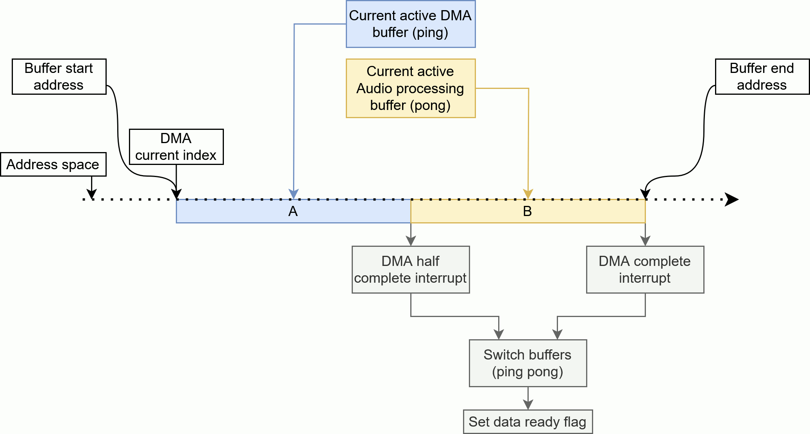

# I2S
This class is a simplfied interface to access the i2s peripheral.
All Basic functions used in the project are implemented here.
The implementation does use a DMA in Full-Duplex mode.
You can find a ready to run project [here](../../Demos/F469/F469_MultiExample/README.md).

---
## Content
- [Features](#features)
- [Setup](#setup)
- [Usage](#usage)
    - [Modify main.h and main.c](#modify-mainh-and-mainc)
    - [Inside the C++ Application](#inside-the-c-application)
- [I2S behind the scenes](#i2s-behind-the-scenes)
    - [Data flow](#data-flow)
    - [Ping-Pong Buffering](#ping-pong-buffering)
    - [Audio Samples](#audio-samples)

---
## Features
- Writing audio samples using a DMA
- Receiving audio samples using a DMA

---
## What is I2S
I2S (Inter-IC Sound) is a serial interface specifically designed for audio data transfer. It is commonly used to transfer digital audio data between microcontrollers, digital-to-analog converters (DACs), and other audio components.
[Click here](#i2s-behind-the-scenes) to learn about how it is implemented in this project.

---
## Setup    
### Inside CubeMX, configure your i2s interface.
  **Mode:** *Full-Duplex Master*
  :white_check_mark: **Master Clock Output**

#### Parameter Settings:
**Transmission Mode:** *Mode Master Transmit*
**Communication Standard:** *I2S Philips*
**Data and Frame Format:** *16Bit Data on 16 Bits Frame*
**Selected Audio Frequency:** *48KHz*
            
#### DMA Settings:
- SPI2_TX:
**Mode:** *Circular*
**Data Width:** *Half Word*


Now start the code generation and open the code editor.
Make sure the C++ application is setup in order to use this class
You can find the instructions on how to do so [here](CppFromC.md).

---
## Usage
CubeMX generates a **I2S_HandleTypeDef** instance in the **main.c**
The **I2S** class needs access to that handle. Since the C++ code can't be used directly in the **main.c**, another way of getting to the handle is needed.
Make sure the C++ application is setup, you can find the instructions on how to do so [here](CppFromC.md).

#### Modify main.h and main.c
In the **main.h** create a get function that returns a pointer to the handle we want.
``` C
// main.h

// Function declaration
I2S_HandleTypeDef* getI2S_CODEC();
```

``` C
// main.c

/* Private variables generated by CubeMX */
I2S_HandleTypeDef hi2s1;

/* USER CODE BEGIN PV */
// Function implementation
I2S_HandleTypeDef* getI2S_CODEC()
{
    // Return the pointer to the handle
    return &hi2s1;
}
/* USER CODE END PV */
```
---
#### Inside the C++ Application

The I2S class uses a buffer, the size of the buffer is defined either in static or dynamic mode.
What this means is that if a static memory allocation is prefered because it is easier to track the memory usage, 
then make sure that the macro: `VMB_I2S_USE_STATIC_BUFFER_SIZE` is defined. 
The size for all I2S instances is then defined by the macro: `VMB_I2S_STATIC_BUFFER_SIZE`.
Both macros are located in the **settings.h** file.

> [!WARNING]
> When the macro **VMB_I2S_USE_STATIC_BUFFER_SIZE** is defined, 
> Providing a size value to the constructor of a I2S object, will have no effecet to its buffer size.  

``` C++ 
// Application.cpp
#include "BSP_VoiceMailBox.hpp" // includes "peripherals/i2s.hpp"
#include "main.h" // Is needed to access the handle get function
#include <memory>

VoiceMailBox::I2S* i2s = nullptr;

void setup()
{
    // Create a I2S object and providing the handle from the main.c. Using the same I2S handle as the codec uses.
    // Use a int16_t[1024] array for data in and out. (only used if the macro VMB_I2S_USE_STATIC_BUFFER_SIZE is not defined)
    i2s = new VoiceMailBox::I2S(getI2S_CODEC(), 1024); 

    // Because we use the same I2S, we do the setup of the platform so that the codec is initialized correctly.
    VoiceMailBox::setup();
    // Since we use the same I2S handle and the DMA was already started in the BSP_VoiceMailBox::setup(), we stop the dma from the platforms codec 
    // so that we can use our own I2S instance
    i2s->stopDMA();

    // If you instantiate a I2S independently from the platforms own I2S, connected to the codec, you don't need the two function calls above.


    // Start the DMA for RX and TX data transfers
    if(!i2s->startDMA())
    {
        VoiceMailBox::println("I2S DMA start failed!");
    }
    else
    {
        VoiceMailBox::println("I2S DMA started successfully.");
    }
}

void loop()
{
    // Check if there was a Ping-Pong swap, triggered by the DMA ISR
    if (i2s->isDataReadyAndClearFlag())
    {
        // Get pointers to the microphone and speaker data array. 
        volatile int16_t* microphoneSamples = i2s->getRxBufPtr();
        volatile int16_t* audioOutSamples = i2s->getTxBufPtr();

        // Size of the current ping or pong buffer
        uint32_t bufferSize = i2s->getBufferSize();

        // Example processing: 
        // Stream the microphone directly back to the output
        memcpy((int16_t*)audioOutSamples, (int16_t*)microphoneSamples, bufferSize * sizeof(int16_t));
    }
}
```


## I2S behind the scenes
### Data flow
Since we use the I2S in Full-Duplex mode, we have 2 audio DMA streams which are processed at the same time by a DMA.

<tr>
<td>
<div align="center">
     
</div>
</td>

### Ping-Pong Buffering
Audio data is sampled continuously and it is not possible to store a infinite amount of samples until the recording stops. A simple solution to this problem is a ping-pong buffer. A ping-pong buffer is a array that is split in 2 equal sized sub array's.

At the start of a DMA transmit, the start of the array is given to the HAL's DMA start call with the half size of the whole array.
While the DMA is processing the first half of the array, the CPU can be used to fill the second half of the DMA buffer.
When the DMA triggers an half complete interrupt, the DMA gets restarted but now with the second half of the array, now using the prepared data in the second half of the array.
While the DMA sends these samples over i2s, the CPU can now fill the first half of the array with new data.

<tr>
<td>
<div align="center">
     
</div>
</td>

Two of these Ping-Pong Buffer array's are implemented in the I2S class. One for microphone data and one for audio output samples.

### Audio Samples

<tr>
<td>
<div align="center">
     
</div>
</td>

The audio data stream comming/going from/to the audio codec contains both, left and right audio channel data.
A audio sample is defined as a package consisting of one left and one right int16 value.
