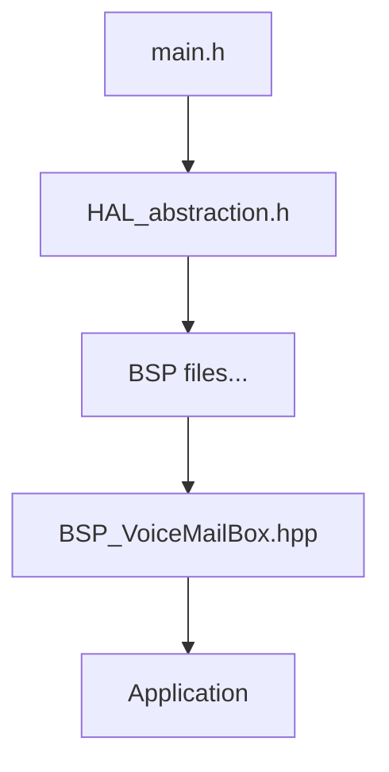
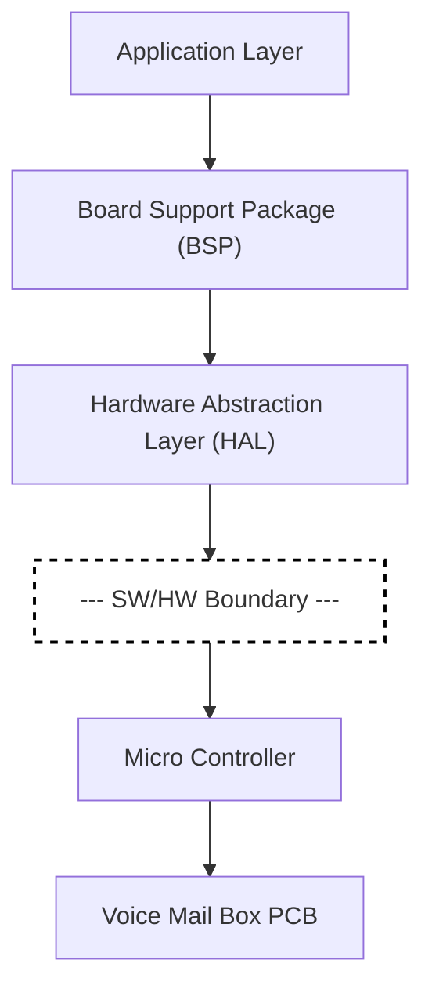

```mermaid

```


```mermaid
flowchart TD
    main[main.h]
    HAL_abstraction[HAL_abstraction.h]
    BSP_files[BSP files...]
    BSP_VoiceMailBox[BSP_VoiceMailBox.hpp]
    Application[Application]

    main --> HAL_abstraction
    HAL_abstraction --> BSP_files
    BSP_files --> BSP_VoiceMailBox
    BSP_VoiceMailBox --> Application

```

```mermaid

flowchart TD
    Application["Application Layer"]
    BSP["Board Support Package (BSP)"]
    HAL["Hardware Abstraction Layer (HAL)"]
    Divider["--- SW/HW Boundary ---"]
    MicroController["Micro Controller"]
    VoiceMailBoxPCB["Voice Mail Box PCB"]

    Application --> BSP
    BSP --> HAL
    HAL --> Divider
    Divider --> MicroController
    MicroController --> VoiceMailBoxPCB

    style Divider stroke-dasharray: 5, 5
    style Divider stroke-width:2px
    style Divider fill:#ffffff,stroke:#000000


```

```mermaid


```

